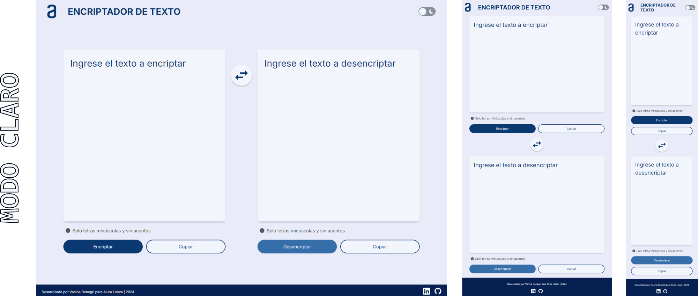

<h1>ENCRIPTADOR DE TEXTO V.3 :mag:</h1>

<h2>Descripción del proyecto :bulb:</h2>

Encriptador de texto realizado para el Challenge ONE Front End de Alura-Latam.
 Esta página web permite encriptar y desencriptar un texto, además de copiarlo al portapapeles.

<h3>Funcionalidad :wrench:</h3>

La encriptación funciona de ida y vuelta usando las claves: 
 :small_blue_diamond: La letra "a" es convertida a "ai"
 :small_blue_diamond: La letra "e" es convertida a "enter"
 :small_blue_diamond: La letra "i" es convertida a "imes"
 :small_blue_diamond: La letra "o" es convertida a "ober"
 :small_blue_diamond: La letra "u" es convertida a "ufat"

<h3>Requisitos :clipboard:</h3>

:heavy_check_mark: Debe funcionar solo con letras minúsculas
 :heavy_check_mark: No deben ser utilizados letras con acentos ni caracteres especiales.
 :heavy_check_mark: La página debe tener campos para la inserción del texto que será encriptado o desencriptado.
 :heavy_check_mark: El usuario debe poder escoger entre las dos opciones: encriptar o desencriptar.
 :heavy_check_mark: El resultado debe ser mostrado en la pantalla.

<h3>Ejemplo :thumbsup:</h3>      

_galtober_<=>_galtober_=>_gato-gray?style=flat">

<h3>Extras :star2:</h3>

Un botón que copie el texto encriptado/desencriptado para la sección de transferencia, o sea que tenga la misma funcionalidad del ctrl+C o de la opción "copiar" del menú de las aplicaciones.

<h2>Versiones :alien:</h2>

<h3>Versión :one:</h3>

Mantiene el branding y el diseño propuesto por Alura Latam con la intención de traducir lo más fielmente posible el prototipo en Figma y mantiene las funcionalidades descriptas más arriba.

 

<h3>Versión :two:</h3>

a. Se tomó el diseño y el branding base propuesto por Alura Latam y se cambió la distribución de los elementos manteniendo las funcionalidades principales de encriptar/desencriptar/copiar mensaje.
 b. Se agregó un switch para modo claro / modo oscuro.
 c. Se agregó un botón para intercambiar el texto entre ambas cajas.

 

<h3>Versión :three:</h3>

a. Se propone un nuevo diseño basado en la tendencia neo-brutalism, se mantuvo la distribución de los elementos de la versión 2 y las funcionalidades principales de encriptar/desencriptar/copiar mensaje.
 b. Se agregó un switch para modo claro / modo oscuro.
 c. Se agregó un botón para limpiar las cajas.
 d. A modo de mantener la constinuidad con el primer diseño de Alura, se actualizó la imagen a los colores y diseño general.

 

<h2>Acceso al proyecto :link:</h2>

    Versión v.1 (original):
 
   
    &#9670;
    
    &#9670;
    
    &#9670;
    
    &#9670;
 
 
    Versión v.2 (personalizada):
 
   
    &#9670;
    
    &#9670;
    
    &#9670;
    
    &#9670;
 
   
    Versión v.3 (personalizada):
 
   
    &#9670;
    
    &#9670;
    
    &#9670;
    
    &#9670;

<h2>Autoría :woman:</h2>

El proyecto fue desarrollado por Vanina Denegri en base a los diseños provistos por Alura-Latam.
 
 
    &#9632;
    
    &#9632;
    
    &#9632;

<h2>Reconocimientos :crown:</h2>

Links útiles y utilizados para realizar este README:
 
 
    &#9679;
    
    &#9679;
    
    &#9679;
    
    &#9679;

<h2>Muestrame tu apoyo :gift_heart:</h2>

Si te gustó mi proyecto podés dejarme alguna estrellita :star:
 
Mandarme algún mensaje :e-mail:
 
O seguirme en redes para comentar y compartir :bell:
 
Dame los reconocimientos correspondientes si es necesario :gift_heart:  

<h2>Notas finales :exclamation:</h2>

Este es uno de mis primeros "grandes" proyectos. Le puse mucho amor y mucho tiempo de dedicación. Aún me quedan cosas por aprender, mejorar mis "buenas prácticas", trabajar mejor en el responsive, utilizar mejor GitHub, etc., etc., etc. Por favor, miralo con el mismo amor que yo y si tenés algún comentario para ayudarme a crecer lo recibiré atentamente siempre y cuando venga con respeto.

<h2>Licencia :warning:</h2>

Este proyecto está bajo la licencia 
